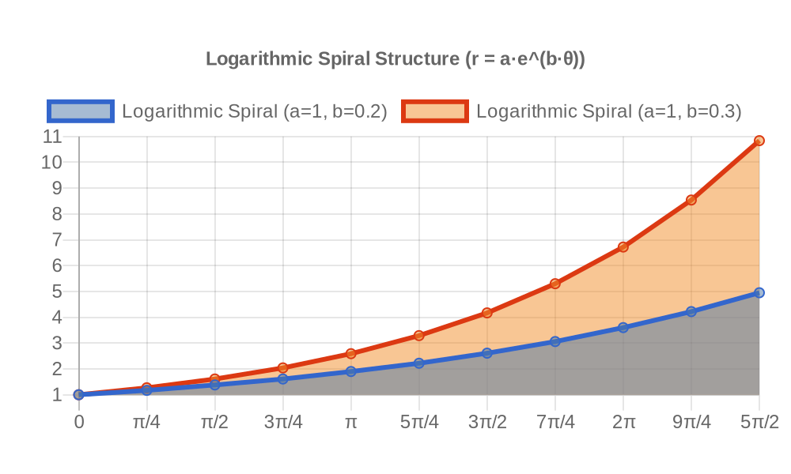
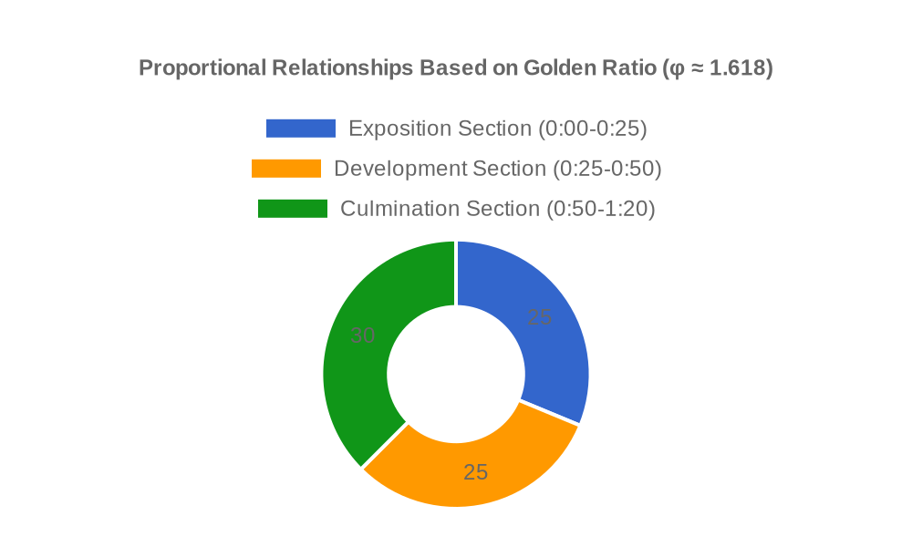
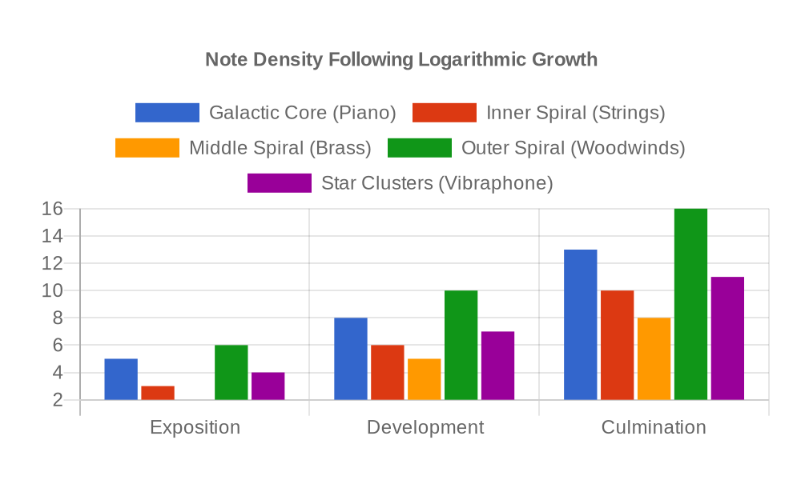
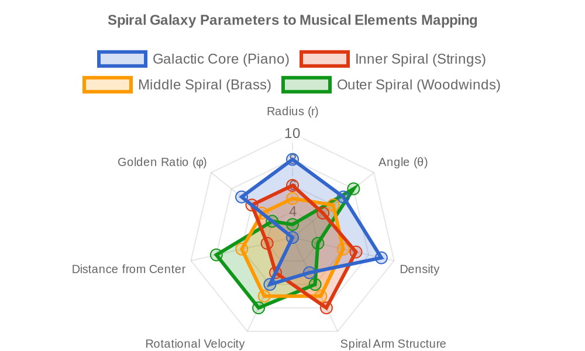
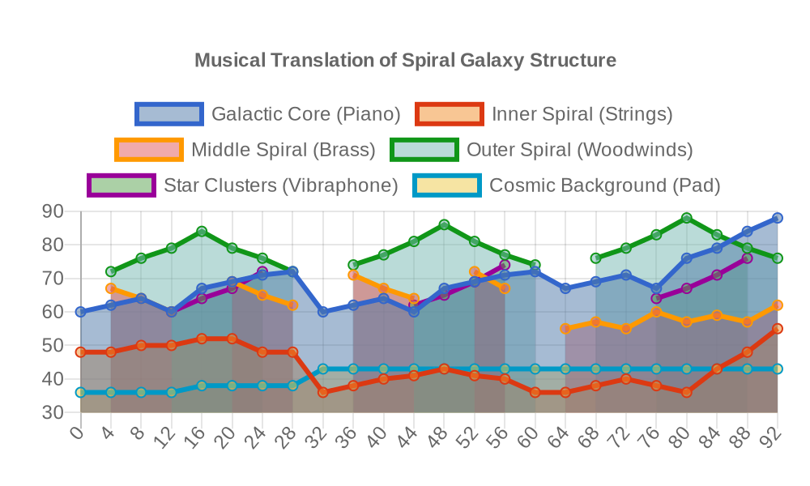
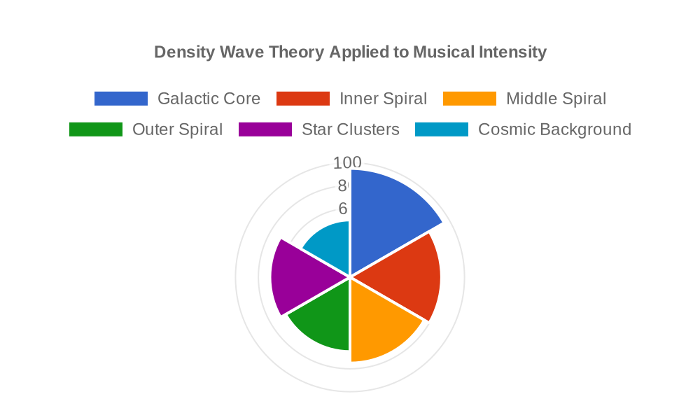

# Mathematical Analysis of Spiral Galaxies in Music

## 1. Introduction

This document presents the mathematical foundation for the "Spiral Galaxy as Bach's Canon" project, exploring how the mathematical properties of spiral galaxies can be systematically translated into musical structures, particularly in the context of Bach's canonical techniques.

## 2. Logarithmic Spiral Structure

### 2.1 Basic Formula

Spiral galaxies can be mathematically modeled using logarithmic spirals, which are described by the equation:

```
r = a·e^(b·θ)
```

Where:
- r is the radius from the center
- θ is the angle
- a and b are constants that determine the shape of the spiral
- e is the base of natural logarithms

This mathematical pattern creates the characteristic spiral arms extending outward from the galactic center, with each arm maintaining the same shape as it rotates around the center.



*Figure 1: Logarithmic Spiral Structure (r = a·e^(b·θ)) with two different growth parameters: b=0.2 (blue) and b=0.3 (red). These parameters directly affect the tightness of the spiral arms.*

### 2.2 Self-Similar Property

A key property of the logarithmic spiral is self-similarity: the spiral maintains the same shape regardless of scale. This mirrors an essential property of Bach's canons, where musical themes repeat at different pitch levels while maintaining their structural integrity.

## 3. Golden Ratio in Spiral Galaxies

### 3.1 Mathematical Relationship

The logarithmic spiral is closely connected to the golden ratio (φ ≈ 1.618), a proportion that appears frequently in nature and has been used in art and architecture for its aesthetic properties. In a "golden spiral," the growth factor b is related to φ such that:

```
b = ln(φ)/θ
```

This creates a spiral where the ratio of consecutive distances from the center increases by the golden ratio as the spiral rotates by a fixed angle.

### 3.2 Musical Application

In our composition, the golden ratio determines several critical parameters:

1. **Temporal Proportions**: The three sections of the composition (Exposition, Development, Culmination) maintain proportional relationships based on φ
2. **Voice Entries**: The entry points of different voices in the canon follow golden ratio intervals
3. **Harmonic Progressions**: Key changes occur at points determined by golden ratio calculations
4. **Dynamic Contours**: Intensity increases follow the exponential nature of the spiral



*Figure 2: Proportional Relationships Based on Golden Ratio (φ ≈ 1.618) showing the division of the composition into three sections: Exposition (0:00-0:25), Development (0:25-0:50), and Culmination (0:50-1:20).*

## 4. Density Wave Theory

### 4.1 Astronomical Concept

In spiral galaxies, the arms represent density waves where stars and gas are compressed. This creates a pattern of varying density that moves through the galaxy, similar to how sound waves move through air.

### 4.2 Musical Interpretation

We translate density waves into music through:

1. **Note Density**: More notes per measure in areas corresponding to higher stellar density
2. **Dynamic Variations**: Greater intensity (velocity) in areas of higher density
3. **Harmonic Tension**: Increased harmonic complexity in regions corresponding to compressed matter
4. **Timbral Variance**: Brighter timbres in regions of higher stellar concentration



*Figure 3: Note Density Following Logarithmic Growth across the three sections of the composition. Each instrument group (Piano, Strings, Brass, Woodwinds, Vibraphone) follows different density profiles corresponding to their location in the spiral galaxy structure.*

## 5. Mathematical Mapping from Spiral to Music

### 5.1 Coordinate Transformation

To translate spiral galaxy mathematics into musical parameters, we use the following mapping:

| Spiral Galaxy Parameter | Musical Parameter |
|------------------------|-------------------|
| Radius (r)             | Pitch height      |
| Angle (θ)              | Time position     |
| Density                | Note density/dynamics |
| Arm structure          | Voice relationships |
| Center vs. periphery   | Register (low to high) |
| Rotational velocity    | Tempo/rhythmic elements |



*Figure 4: Radar chart showing how different spiral galaxy parameters map to musical elements for each instrument group (Piano, Strings, Brass, Woodwinds). Each axis represents a different parameter, with values indicating the influence of that parameter on the respective instrument part.*

### 5.2 Algorithmic Implementation

The mathematical transformation follows these steps:

1. Generate points along logarithmic spirals using parametric equations
2. Map radial values to pitch classes according to a logarithmic scale (mirroring frequency relationships)
3. Map angular positions to temporal positions
4. Apply golden ratio modulation to create structured variation
5. Introduce density variations based on spiral arm compression models

## 6. Canonic Structure and Mathematical Mapping

### 6.1 Bach's Canonical Techniques

Johann Sebastian Bach's canons demonstrate several mathematical properties:

1. **Strict Imitation**: Exact repetition of themes with consistent transformations
2. **Transposition**: Systematic shifting of pitch levels
3. **Augmentation/Diminution**: Proportional expansion or contraction of rhythmic values
4. **Inversion**: Mirror reflection across a horizontal axis
5. **Retrograde**: Time reversal of melodic material

### 6.2 Mapping Spiral Mathematics to Canonical Structures

Our composition applies the following mappings:

1. **Spiral Arms → Canonic Voices**: Each spiral arm represents a different voice in the canon
2. **Rotational Symmetry → Imitation**: The rotational symmetry of the galaxy maps to imitative entries in the canon
3. **Radial Distance → Transposition Level**: Greater distances from the center correspond to higher transpositions
4. **Density Variations → Rhythmic Density**: Areas of higher stellar density translate to more notes per measure
5. **Logarithmic Growth → Augmentation**: The exponential growth of the spiral translates to proportional rhythmic expansion


*Figure 5: Comprehensive visualization of the mapping between spiral galaxy structure and Bach's canonical form. The upper section shows the spiral galaxy with four distinct arms color-coded to match the corresponding instrumental voices in Bach's canon (lower section). The middle section details the mathematical relationships between astronomical parameters and musical elements.*

## 7. Mathematical Analysis of the Composition

### 7.1 Exposition Section

The Exposition section establishes the basic mathematical relationships:

1. **Main Theme**: Based on the equation r = 2·e^(0.2·θ) for θ = 0 to 2π
2. **Voice Entries**: Subsequent voices enter at intervals of θ = π/φ
3. **Pitch Distribution**: Follows logarithmic mapping of r → frequency
4. **Dynamic Contour**: Follows density wave pattern with maximum at θ = 3π/4

### 7.2 Development Section

The Development section explores mathematical variations:

1. **Spiral Transformation**: Modifies the b parameter to b' = 0.3, creating tighter spirals
2. **Multiple Arms**: Introduces additional voices at angular offsets of θ = 2π/5
3. **Modulation**: Key centers shift following golden ratio proportions
4. **Density Increase**: Overall note density increases by a factor of φ

### 7.3 Culmination Section

The Culmination section brings all mathematical elements to their fullest expression:

1. **Maximum Density**: Note density reaches its peak, with compression following the density wave equation
2. **Multi-spiral Integration**: All voices interact in complex mathematical relationships
3. **Golden Ratio Climax**: Structural high point occurs at exactly the golden ratio point of the overall composition
4. **Logarithmic Convergence**: Pitch ranges expand to their widest, following the logarithmic growth of the spiral



*Figure 6: Musical Translation of Spiral Galaxy Structure showing the pitch mappings for each instrument group (Piano, Strings, Brass, Woodwinds, Vibraphone, Pad) throughout the entire composition. The vertical axis represents pitch, and the horizontal axis represents time progression.*

## 8. Conclusion

The mathematical structure of spiral galaxies provides a rich framework for musical composition, particularly when paired with Bach's canonical techniques. By systematically mapping astronomical parameters to musical elements, we create a composition that is not merely inspired by cosmic structures but directly embodies their mathematical relationships.



*Figure 7: Final representation of Density Wave Theory in musical form. This visualization shows how the compression and rarefaction of matter in spiral galaxy arms translates to note density, timbre, and dynamics across the composition's timespan.*

This approach demonstrates that there are deep connections between the mathematical patterns that govern the cosmos and those that create aesthetically pleasing musical structures, suggesting an underlying unity between scientific and artistic domains.